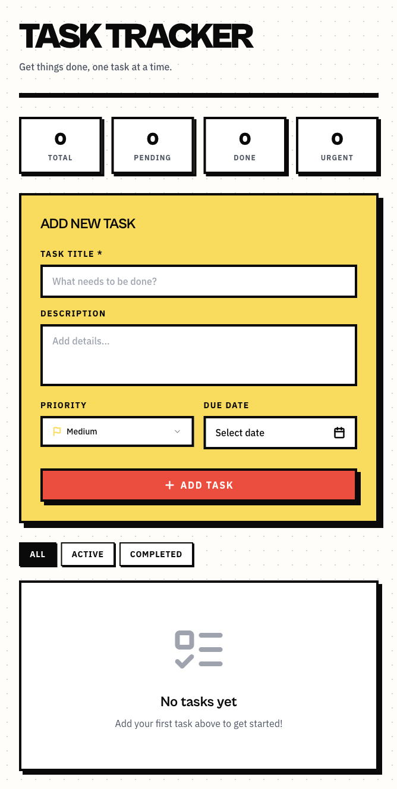
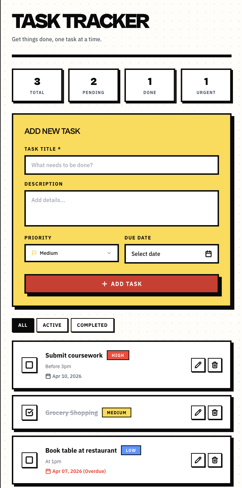

# ✅ Task Tracker App

A simple todo app to keep track of everything you need to get done 📝 Built with React, FastAPI, and MongoDB.

---

## ✨ Features

- 📋 Create, read, update, and delete tasks
- 🎨 Clean and responsive UI built with shadcn components
- ⚡ Fast and lightweight REST API backend
- 🗄️ Persistent data storage with MongoDB
- 🔄 Real-time updates with React state management

---

## 📸 Screenshots

### 🏠 Home Page


### ➕ Tasks Created


---

## 🛠️ Tech Stack

| Layer | Technology |
|---|---|
| Frontend | React, Craco, shadcn/ui, Tailwind CSS |
| Backend | FastAPI, Uvicorn, Motor |
| Database | MongoDB |
| Language | JavaScript, Python |

---

## 🚀 Getting Started

### Prerequisites

Make sure you have the following installed before you begin:

- [Node.js](https://nodejs.org/) (v18+)
- [Python](https://www.python.org/) (3.9+)
- [MongoDB](https://www.mongodb.com/) (via Homebrew or manual install)
- [Yarn](https://yarnpkg.com/)

---

### 1. Start MongoDB

```bash
brew services start mongodb-community
```

---

### 2. Backend Setup

```bash
# Navigate to the backend folder
cd backend

# Create and activate a virtual environment
python3 -m venv venv
source venv/bin/activate  # On Windows: venv\Scripts\activate

# Install dependencies
pip install -r requirements.txt

# Run the server
uvicorn server:app --host 0.0.0.0 --port 8001 --reload
```

Make sure your `backend/.env` file looks like this:

```
MONGO_URL="mongodb://localhost:27017"
DB_NAME="todo_app"
CORS_ORIGINS="*"
```

---

### 3. Frontend Setup

```bash
# Navigate to the frontend folder
cd frontend

# Install dependencies
yarn install

# Run the app
yarn start
```

Make sure your `frontend/.env` file looks like this:

```
REACT_APP_BACKEND_URL=http://localhost:8001
```

---

### 4. Open the App 🎉

| Service | URL |
|---|---|
| Frontend | http://localhost:3000 |
| Backend API | http://localhost:8001/api/todos |

> 💡 **Tip:** Run the backend and frontend in separate terminal tabs so both stay active at the same time!